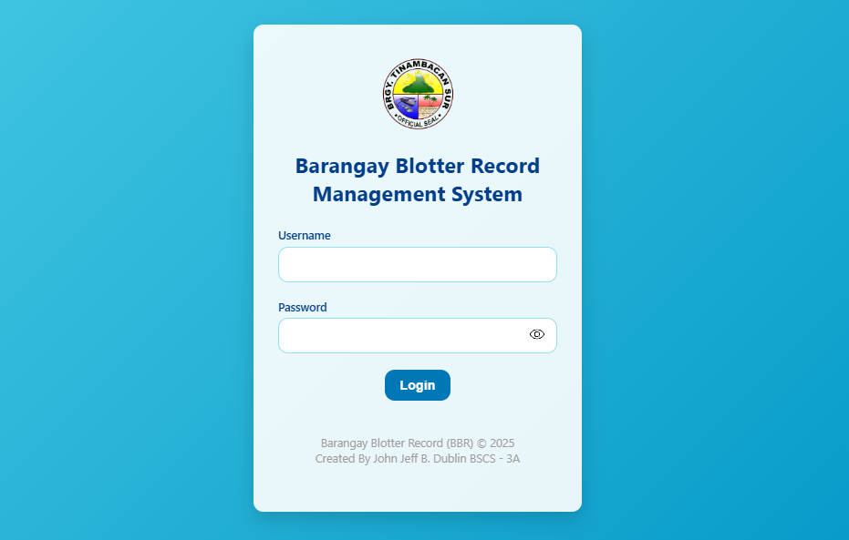
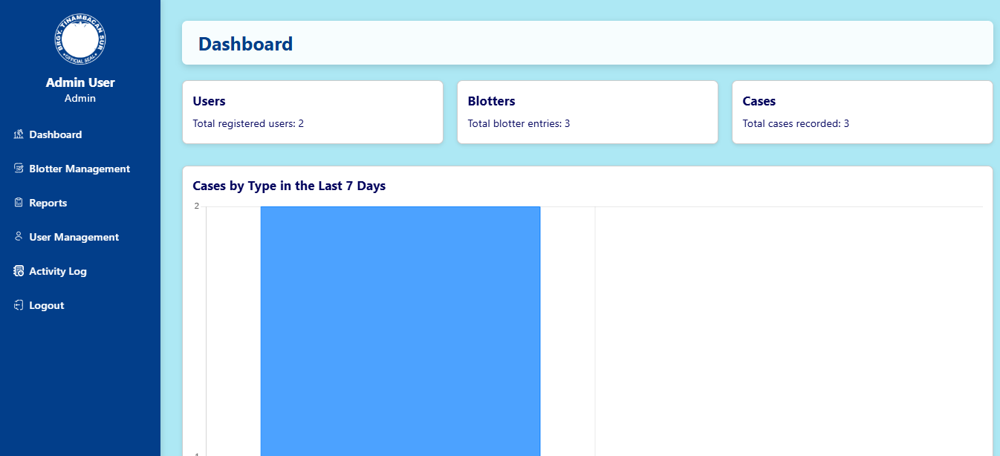
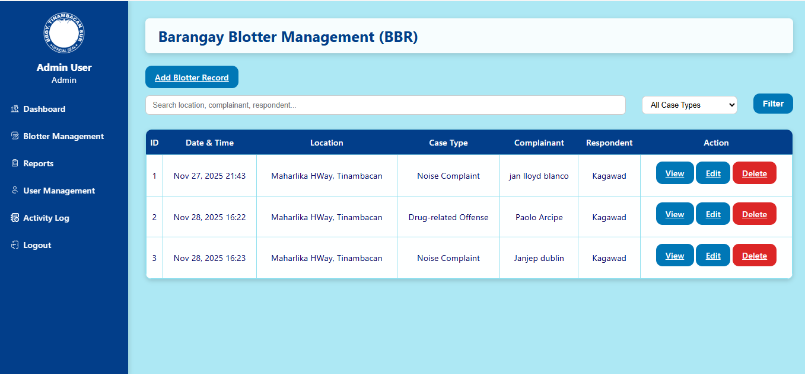
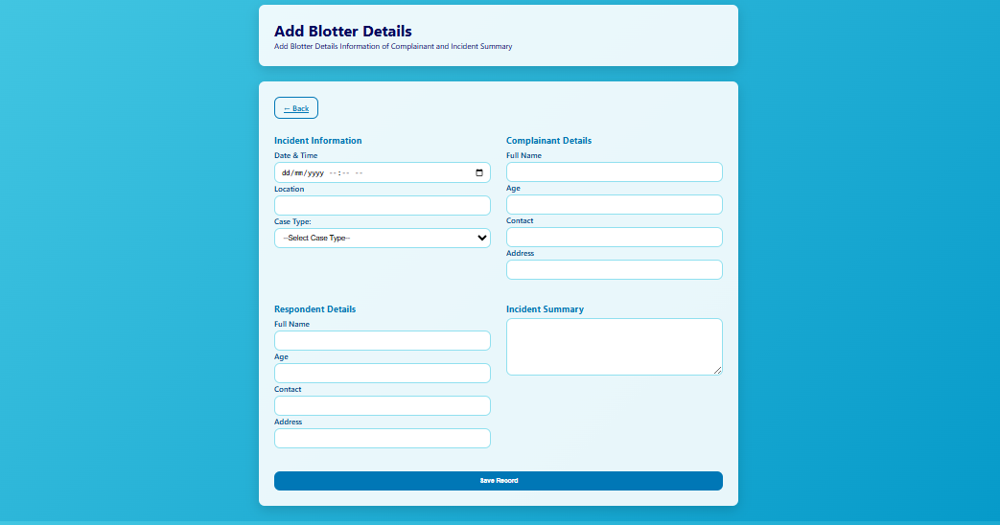
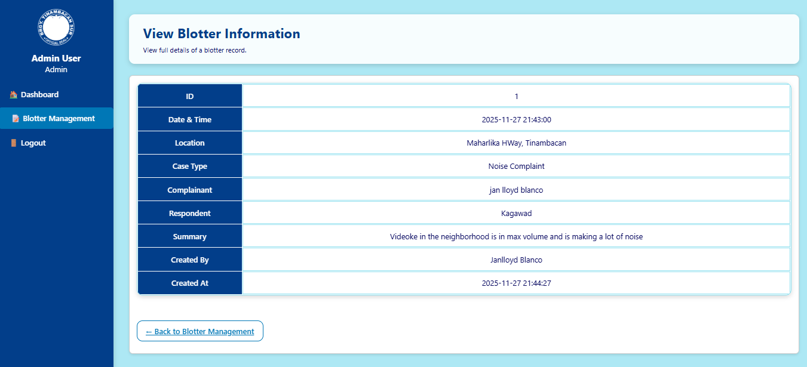
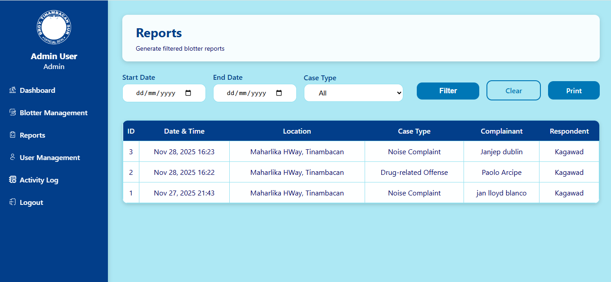
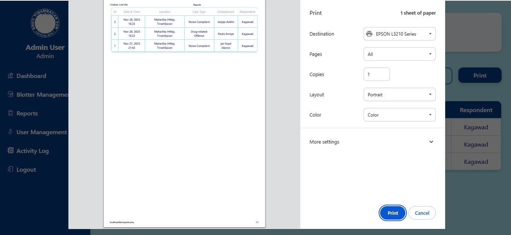
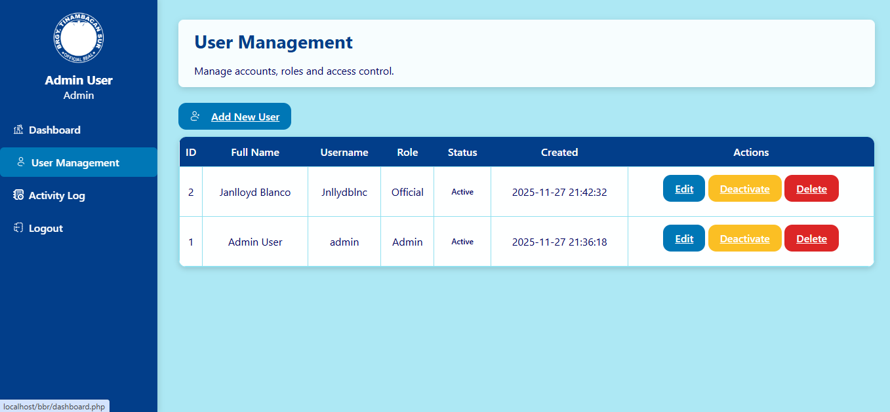
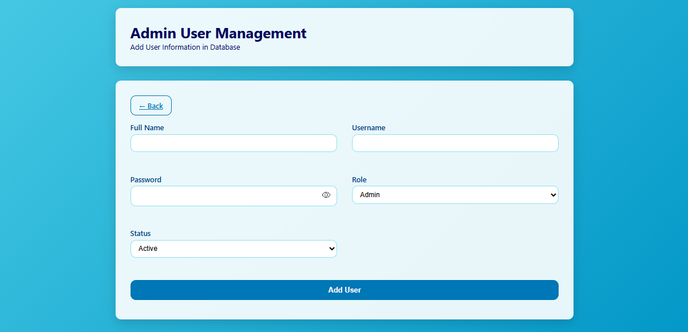
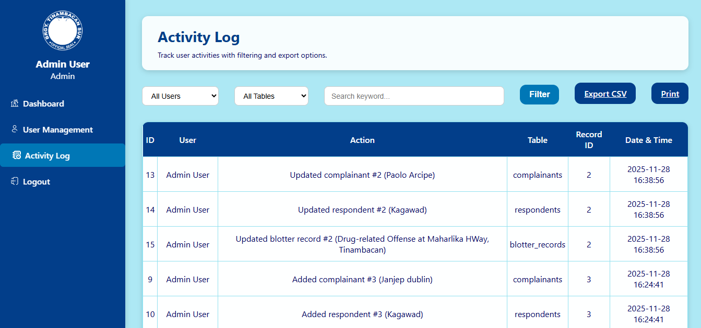

# BBR-Barangay-Blotter-Record_information-System
A system designed to streamline the recording, management, and retrieval of blotter reports at the local barangay level. It helps barangay officials efficiently document incidents, track case statuses, and maintain accurate historical records, improving transparency, accessibility, and response time for community concerns.

